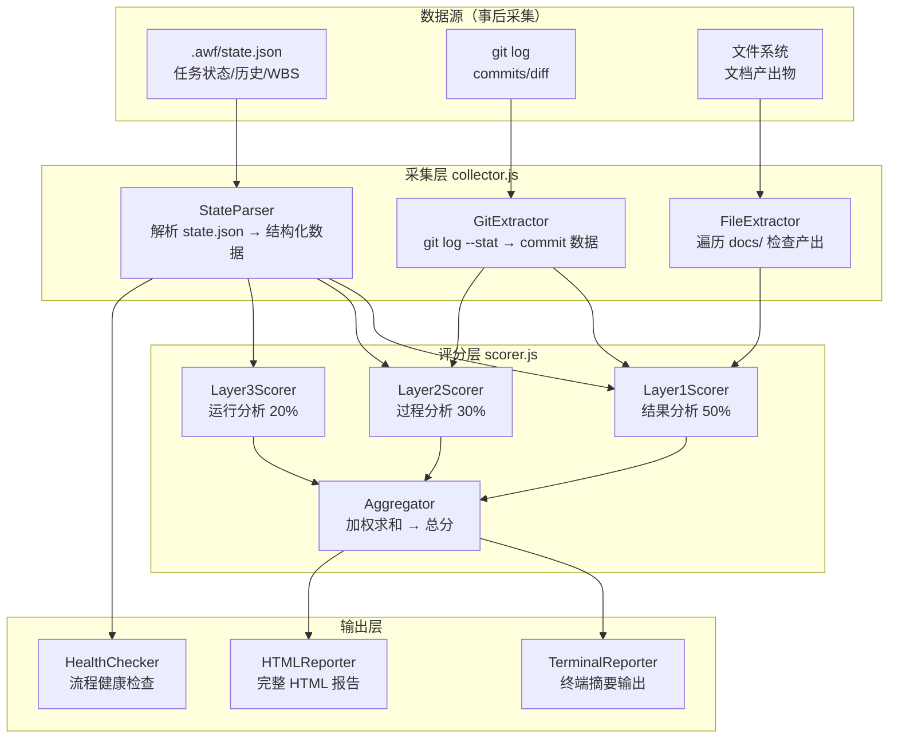
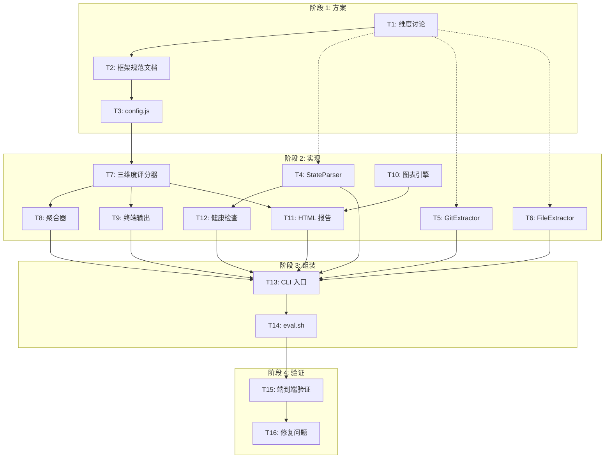

# AWF 测评数据统计工具 需求文档

## 背景与目标

### 背景
ai-workflow (AWF) 是一个 Claude Code 插件 + CLI 工具，给 AI 加上持久记忆、工作流编排和自主推进能力。当前项目**没有任何可用的测评机制** — `scripts/eval.sh` 是占位符，`npm run eval` 输出 "Not yet implemented"。roadmap section 4 定义了测评愿景但未实现。

### 核心痛点
- **无法量化改进**：修改 prompt 策略或状态机逻辑后，不知道效果变好还是变差
- **能力边界不清晰**：不知道 AWF 擅长什么任务、不擅长什么任务
- **流程稳定性不可见**：`awf run` 可能卡住、死循环、中断恢复失败，但无监控手段
- **没有版本对比基线**：每次改动靠直觉判断，无法数据驱动

### 目标
构建一套独立的测评数据统计工具（CLI + HTML 报告），对 `awf run` 的执行过程和产出进行**多维度量化评分**，支撑三个核心用途：

| 优先级 | 用途 | 说明 |
|--------|------|------|
| **P0** | 版本迭代对比 | 同一需求跑不同版本 AWF，对比评分变化，确保每次修改是正向的 |
| **P0** | 能力边界探测 | 不同难度任务探测 AWF 的能力上限和短板，指导优化方向 |
| **P1** | 质量门禁 | 作为发版前检查，核心流程不能断（非阻塞，告警即可） |

### 设计原则
- **事后分析优先**：先基于 `awf run` 已产出的产物（state.json、文档、git log）提取评分数据
- **渐进式增强**：如果事后分析无法覆盖关键维度（如 token 消耗、实时耗时），再开发 SDK 实时采集
- **技术导向报告**：受众为开发者，报告侧重原始数据 + 图表，不做过度的文字解释

## 业内 AI 编程 Agent 测评手段参考

### SWE-bench（Verified）
- **测什么**：真实 GitHub issue → PR 的端到端解决率
- **怎么测**：给定 issue 描述 + 代码仓库，Agent 产出 patch；运行仓库已有测试，pass 即 resolved
- **指标**：pass@1（一次提交通过率）、coverage（覆盖的 issue 比例）
- **可借鉴**：基于测试用例的客观判定，不依赖人工评分

### Terminal-Bench
- **测什么**：CLI Agent 在终端环境中的指令执行能力
- **怎么测**：给定自然语言任务 → Agent 执行 shell 命令 → 判断最终状态是否正确
- **指标**：任务成功率、平均命令数、错误恢复率
- **可借鉴**：多轮交互的效率度量、错误恢复能力评估

### Claude Code 内部评测
- **测什么**：代码生成、调试、重构等多维度能力
- **怎么测**：预定义 test fixture（需求 + 仓库），运行 Agent 后检查产出
- **指标**：任务完成率、工具调用准确率、代码正确性（测试通过率）、安全检查（是否拒绝危险操作）
- **可借鉴**：分难度的 test fixture 设计、工具调用链分析

### 综合对照表

| 维度 | SWE-bench | Terminal-Bench | Claude Code 内评 | AWF 适用性 |
|------|-----------|----------------|------------------|------------|
| 任务完成度 | ✅ 核心指标 | ✅ 核心指标 | ✅ | ✅ 直接适用 |
| 代码正确性 | ✅ 测试通过 | ❌ | ✅ 测试通过 | ✅ 直接适用 |
| 过程效率 | ❌ | ✅ 命令数/步数 | ✅ turn 数 | ✅ 核心关注 |
| Token 消耗 | ❌ | ❌ | ✅ | ✅ 成本度量 |
| 稳定性/鲁棒性 | ❌ | ✅ 错误恢复 | ✅ | ✅ 流程不中断 |
| 输出质量 | ❌ | ❌ | ✅ | ✅ 文档/commit |
| 自主性 | ❌ | ❌ | ✅ | ✅ 核心差异点 |

## AWF 测评维度框架

### 三层架构

```
┌─────────────────────────────────────────────────────┐
│                  AWF 测评框架                          │
├─────────────────────────────────────────────────────┤
│  Layer 1: 结果分析 (Result)  — 产出了什么？           │
│  Layer 2: 过程分析 (Process) — 怎么产出的？           │
│  Layer 3: 运行分析 (Runtime) — 跑得顺畅吗？           │
└─────────────────────────────────────────────────────┘
```

## 维度总清单

> 共 **26 项指标**，标注 `[事后]` 的本次可实现，标注 `[需实时]`/`[需日志]`/`[需 API]` 的留待 Phase 2 SDK 方案。

| ID | 层级 | 指标 | 一句话定义 | 采集 |
|----|------|------|-----------|------|
| R1 | L1·结果 | 任务完成率 | done 任务数 / 总任务数 | 事后 |
| R2 | L1·结果 | WBS 覆盖率 | 有 task 覆盖的 WBS 项 / 总 WBS 项 | 事后 |
| R3 | L1·结果 | 验收标准通过率 | 实际通过的验收标准 / 计划总数 | 事后+人工 |
| R4 | L1·结果 | Scope 偏离度 | 产出了 outOfScope 中的项数量 | 事后 |
| R5 | L1·结果 | Review 严重度分布 | critical / major / minor 问题计数 | 事后 |
| R6 | L1·结果 | Lint 通过率 | 首次 lint 通过的 task 数 / 总 task 数 | 事后 |
| R7 | L1·结果 | 测试回归率 | task 执行前后被修改的测试文件数 | 事后 |
| R8 | L1·结果 | 文档完整度 | 实际产出的文档 / 应有文档类型数 | 事后 |
| R9 | L1·结果 | Commit 规范性 | Conventional Commits 格式占比 | 事后 |
| R10 | L1·结果 | 代码规模合理性 | 每 task 代码行数是否在合理范围 | 事后 |
| P1 | L2·过程 | 阶段耗时 | 每阶段 wall-clock 时间 | **需实时** |
| P2 | L2·过程 | Turn 数/阶段 | 每阶段对话轮次 | **需实时** |
| P3 | L2·过程 | DEBUG 循环数 | 每 task 进入 DEBUG 的次数 | 事后 |
| P4 | L2·过程 | Review 循环数 | 每 task 的 REVIEW→CODE 回退次数 | 事后 |
| P5 | L2·过程 | One-shot 成功率 | `/w-prompt` 的 `claude -p` 调用成功比例 | **需日志** |
| P6 | L2·过程 | Token 消耗 | 每阶段 input + output tokens | **需 API** |
| P7 | L2·过程 | Commit 频率 | 每 task 的 commit 数量 | 事后 |
| P8 | L2·过程 | 无效产出率 | 被后续 commit 覆盖的代码行数 / 总行数 | 事后 |
| S1 | L3·运行 | 死循环检测 | 同一 task 连续产生相同 exec.result 的次数 | 事后 |
| S2 | L3·运行 | 卡住检测 | 某阶段超过阈值时间无进度 | **需实时** |
| S3 | L3·运行 | 中断恢复成功率 | 中断后成功恢复 / 总中断次数 | 事后 |
| S4 | L3·运行 | State 文件完整性 | state.json schema 校验结果 | 事后 |
| S5 | L3·运行 | 人工介入次数 | `.claude/issues/` 中 issue 文件数 | 事后 |
| S6 | L3·运行 | 全自主运行时长 | history[] 首次到末次时间戳差值 | 事后 |
| S7 | L3·运行 | 异常退出率 | 非 FINISH 状态结束 / 总运行次数 | 事后 |
| S8 | L3·运行 | Prompt 生成正确性 | `/w-prompt` 输出是否包含完整 prompt 模板 | **需日志** |

### Layer 1: 结果分析（权重 50%）

**核心问题：AWF 完成任务了吗？产出质量如何？**

| 指标 | 数据来源 | 计算方式 | 数据采集方式 |
|------|---------|---------|-------------|
| 任务完成率 | state.json `tasks[].status` | done / total | 事后 |
| WBS 覆盖率 | state.json `wbs[]` vs `tasks[].wbsRef` | 有 task 覆盖的 WBS / 总 WBS | 事后 |
| 验收标准通过率 | state.json `plan.acceptanceCriteria` vs 人工/自动检查 | 通过数 / 总数 | 事后 + 人工 |
| Scope 偏离度 | state.json `plan.inScope` vs 实际产出文件 | 额外产出 / inScope 项 | 事后 |
| Review 严重度分布 | state.json `tasks[].exec.result` | critical/major/minor 计数 | 事后 |
| Lint 通过率 | 各 task 首次 lint 是否通过 | 首次通过数 / 总 task 数 | 事后 |
| 测试回归率 | test 文件 hash 对比 | 被修改的测试文件数 | 事后 |
| 文档完整度 | 检查必产出文件是否存在 | 实际产出 / 应有产出 | 事后 |
| Commit 规范性 | git log `tasks[].commits[]` | Conventional Commits 占比 | 事后 |
| 代码规模合理性 | git diff --stat | 每 task 行数变化范围 | 事后 |

### Layer 2: 过程分析（权重 30%）

**核心问题：AWF 执行效率如何？有没有浪费？**

| 指标 | 数据来源 | 计算方式 | 数据采集方式 |
|------|---------|---------|-------------|
| 阶段耗时 | state.json `history[]` 时间戳差值 | 每阶段 wall-clock 时间 | **需实时** |
| Turn 数/阶段 | Session Server 请求计数 | 每阶段的对话轮次 | **需实时** |
| DEBUG 循环数 | state.json `history[]` 中 DEBUG 出现次数 | 每 task 的 DEBUG 次数 | 事后 |
| Review 循环数 | state.json `history[]` 中 REVIEW→CODE 回退次数 | 每 task 的回退次数 | 事后 |
| One-shot 成功率 | run.js 日志 | `claude -p` 调用成功/失败 | **需日志** |
| Token 消耗 | API response `usage` 字段 | 每阶段 input/output tokens | **需 API 层采集** |
| Commit 频率 | tasks[].commits[].length | 每 task 的 commit 数量分布 | 事后 |
| 无效产出率 | git diff 对比最终版本 | 被后续 commit 覆盖的代码行数 | 事后 |

### Layer 3: 运行分析（权重 20%）

**核心问题：AWF 能稳定自主运行吗？有没有卡住或需要人工介入？**

| 指标 | 数据来源 | 计算方式 | 数据采集方式 |
|------|---------|---------|-------------|
| 死循环检测 | state.json `exec.result` 重复度 | 连续 N 次相同 result | 事后 |
| 卡住检测 | 阶段耗时超时 | 某阶段超过阈值未完成 | **需实时** |
| 中断恢复成功率 | state.json 中断标记 | 中断后成功恢复的次数 | 事后 |
| State 文件完整性 | JSON parse 校验 | schema 校验通过率 | 事后 |
| 人工介入次数 | `.claude/issues/` 文件计数 | issue 文件数 | 事后 |
| 全自主运行时长 | history[] 首次→末次时间戳 | 从 run 开始到 FINISH 的总时间 | 事后 |
| 异常退出率 | 非 FINISH 状态结束 | 异常退出次数 / 总运行次数 | 事后 |
| Prompt 生成正确性 | One-shot 输出格式校验 | `/w-prompt` 输出是否包含完整 prompt | **需日志** |

### 综合评分公式

```
总分 = Layer1 × 0.50 + Layer2 × 0.30 + Layer3 × 0.20

Layer1 = Σ(指标得分 × 指标权重)
Layer2 = Σ(指标得分 × 指标权重)
Layer3 = Σ(指标得分 × 指标权重)

每个指标得分：0-100 分，基于实际值在基准范围中的位置线性插值
```

### 关键设计决策（待讨论）

> **以下维度框架是初步设计，需要单独多轮沟通细化：**
> 1. 各指标的具体权重分配
> 2. 基准值（baseline）的定义方式 — 硬编码阈值 vs. 历史数据统计 vs. 人工设定
> 3. Token 消耗的采集方案 — Hook API response 还是解析日志
> 4. Turn 数的精确统计 — Session Server 增强还是 tmux 输出解析
> 5. 死循环/卡住的判定阈值

## 用户场景

### 场景 1: 版本对比 — "这次 prompt 优化到底有没有用？"

```bash
# 开发者修改了 prompts/run/dev.md 中的 prompt 模板
# 用同一个 fixture 跑两次 awf run

# 第一次（基线版本）
git checkout main
cd sandbox && awf init && awf plan "做一个象棋游戏" && awf run --local

# 第二次（新版本）
git checkout feature/optimized-prompt
cd sandbox && awf init && awf plan "做一个象棋游戏" && awf run --local

# 测评
awf eval score sandbox/.awf --baseline baseline-run --output report.html
# → 打开 report.html，看到总分从 72 → 84，Layer 2 效率提升明显
# → 结论：prompt 优化有效，继续推进
```

### 场景 2: 能力边界探测 — "AWF 能做到什么程度？"

```bash
# 准备 4 个难度梯度的 fixtures
tests/eval/fixtures/
├── tier1-single-function/    # 单一工具函数
├── tier2-single-component/   # 单组件/页面
├── tier3-multi-module/       # 多模块联动
└── tier4-full-project/       # 完整项目

# 逐个难度跑
for fixture in tests/eval/fixtures/tier*; do
  cd $fixture && awf run --local
done

# 汇总测评
awf eval score tests/eval/fixtures/tier* --output report.html
# → 看到 Tier1-2 评分 >80，Tier3 评分 60-70，Tier4 评分 <50
# → 结论：AWF 当前能力边界在 Tier3，Tier4 需要改进
```

### 场景 3: 质量门禁 — "发版前快速检查"

```bash
# CI 中或本地发版前
awf eval health sandbox/.awf --threshold 60
# → 检查核心流程指标（任务完成率、DEBUG 率、异常退出率）
# → 任一项低于 60 分 → 输出警告 + 非 0 退出码
# → 不阻断发布，但标记需要关注
```

## 功能范围

### 包含
- **`awf eval` CLI 命令**：统一入口，通过 subcommand 区分评分和健康检查
- **多维度评分引擎**：Layer 1/2/3 全部指标的采集和计算逻辑
- **事后数据采集器**：从 state.json、git log、文件系统、文档中提取评分数据
- **HTML 报告生成**：雷达图 + 条形图 + 指标详情表格 + 版本对比 diff
- **健康检查**：核心流程稳定性指标快速检查
- **Test Fixture 模板**：提供 4 个难度梯度的示例 fixture

### 不包含（本次不做）
- **实时 SDK 采集**：如果事后分析不够用，作为 Phase 2 开发
- **基准测试套件**：多 fixture 批量测评 + 历史数据库，Phase 3
- **Web Dashboard**：数据库存储、历史对比、趋势图，Phase 4
- **Token 精确采集**（API 层）：依赖 Claude Code 暴露 usage 数据，待上游支持
- **与外部 CI 系统集成**：仅支持本地运行和 shell 脚本调用

## 验收标准

### 效果调优（评分报告）
- [ ] 执行 `awf eval score <state.json路径>` 能在终端输出总分 + 三层得分
- [ ] 产出 HTML 报告，包含雷达图 + 指标详情表格
- [ ] 所有 Layer 1/2/3 指标都能从 state.json + git log 中正确提取
- [ ] 支持传入两个 state.json 进行版本对比（diff 模式）
- [ ] 各项指标的计算公式在代码中有明确注释

### 流程稳定性（健康检查）
- [ ] 执行 `awf eval health <state.json路径>` 检查核心流程是否正常运行
- [ ] 任务完成率 < 阈值时输出警告
- [ ] DEBUG 循环 > 阈值时输出警告
- [ ] 异常退出时输出警告
- [ ] 全部通过时输出 "OK" + 0 退出码

### 通用
- [ ] 所有代码放在 `tests/` 目录下
- [ ] 提供 `npm run eval` 命令可一键执行
- [ ] 提供至少 1 个 test fixture 供手工验证
- [ ] README 说明使用方法

## 数据采集方案

### 阶段 1: 纯事后分析（本次实现）

```
state.json ──────┐
git log ──────────┤
                 ├──→ 采集器 ──→ 评分引擎 ──→ HTML 报告
文件系统 ─────────┤
文档产出物 ───────┘
```

**可覆盖的指标**：任务完成率、WBS 覆盖率、Scope 偏离度、Review 严重度、DEBUG 循环数、Review 循环数、Commit 规范性、文档完整度、死循环检测（result 重复度）、中断恢复、State 完整性、人工介入次数、全自主运行时长、异常退出率、代码规模、Commit 频率

**无法精确覆盖的指标**（需要实时采集）：
- Token 消耗（需 API 层数据）
- Turn 数（需 Session Server 增强）
- 阶段耗时（需实时打点）
- 卡住检测（需实时监控）

### 阶段 2: SDK 实时采集（待定）

如果阶段 1 的事后分析无法满足效果评估需求，开发轻量 SDK：
- 在 `awf run` 关键节点暴露 hooks（phase_start、phase_end、turn_complete）
- SDK 暴露 `record()` 方法，AWF 内部调用记录
- 保持高内聚低耦合：SDK 独立模块，通过事件机制注入

## 与现有项目的关系

```
cc-control/
├── tests/
│   ├── eval/                    # ← 测评工具代码
│   │   ├── cli.js               #    CLI 入口
│   │   ├── collector.js         #    数据采集器
│   │   ├── scorer.js            #    评分引擎
│   │   ├── reporter.js          #    HTML 报告生成
│   │   ├── health.js            #    健康检查
│   │   └── templates/           #    报告模板
│   ├── fixtures/                #    Test fixtures（测评用）
│   │   ├── chess-state.json     #    已有
│   │   └── go-game-state.json   #    已有
│   └── eval/
│       └── expected/            #    预期输出（未来 benchmark 用）
├── scripts/
│   └── eval.sh                  # ← 开发期入口脚本
└── package.json                 #    npm run eval → scripts/eval.sh
```

---

# 产品原型

## CLI 交互流程

```
awf eval score <path>                     awf eval health <path>
        │                                         │
        ▼                                         ▼
┌──────────────────┐                     ┌──────────────────┐
│ 1. 解析参数       │                     │ 1. 解析参数       │
│    --output html  │                     │    --threshold 60 │
│    --baseline x   │                     │    --json         │
└────────┬─────────┘                     └────────┬─────────┘
         ▼                                         ▼
┌──────────────────┐                     ┌──────────────────┐
│ 2. 加载 state     │                     │ 2. 加载 state     │
│    + git log      │                     │    + 快速校验     │
│    + 文件系统      │                     └────────┬─────────┘
└────────┬─────────┘                              ▼
         ▼                              ┌──────────────────┐
┌──────────────────┐                     │ 3. 核心指标检查   │
│ 3. 数据采集       │                     │    完成率 > 阈值?  │
│    collector.js   │                     │    DEBUG率 < 阈值? │
│    → 原始指标值   │                     │    异常退出?       │
└────────┬─────────┘                     └────────┬─────────┘
         ▼                                         ▼
┌──────────────────┐                     ┌──────────────────┐
│ 4. 评分计算       │                     │ 4. 输出结果       │
│    scorer.js      │                     │    ✓ OK (exit 0)  │
│    → 三层得分     │                     │    ✗ WARN (exit 1) │
└────────┬─────────┘                     └──────────────────┘
         ▼
┌──────────────────┐
│ 5. 报告生成       │
│    reporter.js    │
│    → HTML 报告    │
└────────┬─────────┘
         ▼
┌──────────────────┐
│ 6. 终端摘要输出   │
│    总分 + 三层    │
│    + 文件路径     │
└──────────────────┘
```

## 终端输出格式

### score 命令

```
═══════════════════════════════════════════
  AWF Eval Report
═══════════════════════════════════════════
  Project:    chess-game
  State:      sandbox/.awf/state.json
  Completed:  6/6 tasks  ✓
═══════════════════════════════════════════

  Overall Score: 78 / 100

  Layer 1  Result   (50%)   82  ████████████████████░░░░
  Layer 2  Process  (30%)   71  ██████████████████░░░░░░
  Layer 3  Runtime  (20%)   79  ███████████████████░░░░░

  Details → report.html
═══════════════════════════════════════════
```

### health 命令

```
AWF Health Check

  Task Completion  6/6     ✓ PASS
  DEBUG Rate       0/6     ✓ PASS
  Abnormal Exit    false   ✓ PASS
  State Integrity  valid   ✓ PASS

  Result: ALL PASS (exit 0)
```

## HTML 报告结构

```
┌──────────────────────────────────────────────────────┐
│  AWF Eval Report — chess-game           2026-07-23   │
├──────────────────────────────────────────────────────┤
│                                                      │
│  ┌─────────────────────┐  ┌─────────────────────┐   │
│  │   Overall Score      │  │   Layer Breakdown    │   │
│  │       78             │  │   ██ Result   82    │   │
│  │   ┌───────────┐      │  │   ██ Process  71    │   │
│  │   │  Radar    │      │  │   ██ Runtime  79    │   │
│  │   │  Chart    │      │  │                     │   │
│  │   └───────────┘      │  │                     │   │
│  └─────────────────────┘  └─────────────────────┘   │
│                                                      │
│  ┌──────────────────────────────────────────────┐   │
│  │  Layer 1: Result Analysis (50%)         82   │   │
│  ├──────────────────────────────────────────────┤   │
│  │  Metric              Value    Score   Bar    │   │
│  │  ─────────────────────────────────────────── │   │
│  │  Task Completion     6/6      100    ██████ │   │
│  │  WBS Coverage        5/6       83    █████  │   │
│  │  Acceptance Criteria 4/5       80    █████  │   │
│  │  Review Severity      0 crit  100    ██████ │   │
│  │  Lint Pass Rate      5/6       83    █████  │   │
│  │  ...                                        │   │
│  └──────────────────────────────────────────────┘   │
│                                                      │
│  ┌──────────────────────────────────────────────┐   │
│  │  Layer 2: Process Analysis (30%)        71   │   │
│  ├──────────────────────────────────────────────┤   │
│  │  ...                                        │   │
│  └──────────────────────────────────────────────┘   │
│                                                      │
│  ┌──────────────────────────────────────────────┐   │
│  │  Layer 3: Runtime Analysis (20%)        79   │   │
│  ├──────────────────────────────────────────────┤   │
│  │  ...                                        │   │
│  └──────────────────────────────────────────────┘   │
│                                                      │
│  ┌─ Version Diff (baseline → current) ──────────┐   │
│  │  Metric           Baseline   Current   Δ     │   │
│  │  ─────────────────────────────────────────── │   │
│  │  Overall Score       72        78      +6 ▲  │   │
│  │  Task Completion     83       100     +17 ▲  │   │
│  │  DEBUG Rate         100        83     -17 ▼  │   │
│  │  ...                                        │   │
│  └──────────────────────────────────────────────┘   │
│                                                      │
└──────────────────────────────────────────────────────┘
```

技术选型：
- 纯 HTML + 内联 CSS + 内联 JS（零依赖，可离线打开）
- 图表使用 Canvas API 手绘（不引入 Chart.js 等外部库，保持单文件）
- 雷达图、条形图、堆叠条形图三种图表

## 数据流架构



---

# WBS（工作分解结构）

> 拆分原则遵循 `flow-rule-task` skill：自上而下定位 → 按复杂度决定是否下钻 → 独立可验证的拆、同构的合并。

## 总览

```
Eval Tool（功能级）
  ├── 0. 理解/探索        → 了解 state.json + git log + 已有 fixtures
  ├── 1. 方案/规则        → 维度定义 + 权重 + 基准值（需多轮讨论）
  ├── 2. 分治实现
  │     ├── 2.1 config    → 阈值/权重/基准值配置
  │     ├── 2.2 collector → StateParser / GitExtractor / FileExtractor
  │     ├── 2.3 scorer    → 三维度评分器 + 聚合器(Δ对比)
  │     ├── 2.4 reporter  → 终端输出 / HTML报告 / 图表引擎
  │     └── 2.5 health    → 流程健康检查
  ├── 3. 组装             → CLI 入口（score + health 子命令）+ eval.sh 脚本
  └── 4. 验证             → 端到端验证（已有 fixtures）
```

## WBS 详情

### 1. 方案/规则 — 测评框架规范

**交付物**：`docs/features/eval-framework-spec.md`
**验收方式**：人工评审，维度定义完整、权重分配合理、公式可直接编码
**依赖**：无

包含三个子项，不需要独立 task，作为规范文档的章节：
- 业内标准调研结论（SWE-bench / Terminal-Bench / Claude Code 内评 / Devin）
- 26 项指标定义（名称、数据源、计算公式、基准值）
- 权重矩阵 + 综合评分公式 + 版本对比 Δ 计算

> 维度设计需要 3 轮单独讨论：指标公式 → 实时采集触发条件 → 权重体系

### 2. 配置模块

**交付物**：`tests/eval/config.js`
**验收方式**：配置项齐全，每项有注释
**依赖**：1（权重和基准值确定后）

### 3. 数据采集模块

**交付物**：`tests/eval/collector.js`
**验收方式**：输入已有 fixtures（chess/go state.json），输出结构化 JSON 包含所有事后可采指标
**依赖**：1（指标定义完成后才知道采集什么）

| 子交付物 | 实现类 | 独立验证方式 |
|---------|--------|-------------|
| StateParser | `collector.js` 中 `StateParser` | 输入 chess-state.json → 输出指标原始值 JSON |
| GitExtractor | `collector.js` 中 `GitExtractor` | 对 sandbox 目录运行 → commit 统计正确 |
| FileExtractor | `collector.js` 中 `FileExtractor` | 扫描 docs/ + .claude/issues/ → 统计与手动一致 |

> 三个子交付物数据源独立、可并行验证 → 拆为 3 个独立 task

### 4. 评分引擎

**交付物**：`tests/eval/scorer.js`
**验收方式**：输入已知原始数据 → 输出预期评分（单元测试覆盖边界条件）
**依赖**：1（公式定义）、2（权重配置）、3（数据采集）

| 子交付物 | 实现类 | 独立验证方式 |
|---------|--------|-------------|
| 三维度评分器 | `scorer.js` 中 `LayerScorer` | L1/L2/L3 评分逻辑同构（查表/线性插值），配置驱动 |
| 聚合器 | `scorer.js` 中 `Aggregator` | 已知三层得分 → 总分正确，两组得分 → Δ 正确 |

> 评分器三个 layer 逻辑同构 → 合并为 1 个 task；聚合器独有 Δ 对比逻辑 → 独立 1 个 task

### 5. 报告生成模块

**交付物**：`tests/eval/reporter.js`
**验收方式**：输入评分 JSON → 终端输出 + HTML 文件可浏览器打开
**依赖**：4（需要评分引擎输出）

| 子交付物 | 实现类 | 独立验证方式 |
|---------|--------|-------------|
| 终端输出 | `reporter.js` 中 `TerminalReporter` | 终端输出格式与原型一致 |
| HTML 报告 | `reporter.js` 中 `HTMLReporter` | 产出单文件 HTML，浏览器打开无错误 |
| 图表引擎 | `tests/eval/templates/charts.js` | Canvas 手绘 RadarChart / BarChart / StackedBarChart 渲染正确 |

> 三者逻辑独立，终端+图表可并行，HTML 依赖图表 → 3 个 task

### 6. 健康检查模块

**交付物**：`tests/eval/health.js`
**验收方式**：正常 state → exit 0 / PASS；异常 state → exit 1 / WARN
**依赖**：3（需要 StateParser 读 state.json）

### 7. CLI 入口

**交付物**：`tests/eval/cli.js`
**验收方式**：`node cli.js score <path>` 端到端产出 HTML；`node cli.js health <path>` 输出健康检查
**依赖**：3, 4, 5, 6（所有模块完成后组装）

> score 和 health 两个命令只是 Commander 路由 + 模块串联，薄层不拆 → 1 个 task

### 8. 开发入口脚本

**交付物**：`scripts/eval.sh`
**验收方式**：`npm run eval` 可执行，有使用说明
**依赖**：7

### 9. Test Fixture

**交付物**：`tests/fixtures/chess-state.json`（已有，可能需要增强）
**验收方式**：`node cli.js score tests/fixtures/chess-state.json` 正常运行
**依赖**：7

---

# 任务清单

> 按 `flow-rule-task` 的通用流程排列：理解 → 方案 → 实现 → 组装 → 验证

## 阶段 1: 方案/规则（阻塞后续所有实现）

| # | 任务 | WBS | 说明 |
|---|------|-----|------|
| T1 | 维度讨论（3 轮） | 1 | 第1轮: Layer1 指标公式+基准 / 第2轮: Layer2+3 / 第3轮: 权重 |
| T2 | 产出测评框架规范文档 | 1 | 整合 T1 讨论结论 → `eval-framework-spec.md` |
| T3 | 实现 config.js | 2 | 将规范中的阈值/权重/基准值写成代码 |

## 阶段 2: 分治实现

| # | 任务 | WBS | 依赖 | 并行 |
|---|------|-----|------|------|
| T4 | 实现 StateParser | 3 | T1（指标定义） | [P] |
| T5 | 实现 GitExtractor | 3 | T1 | [P] |
| T6 | 实现 FileExtractor | 3 | T1 | [P] |
| T7 | 实现三维度评分器 | 4 | T1, T3 | - |
| T8 | 实现聚合器（Δ 对比） | 4 | T7 | - |
| T9 | 实现终端输出 | 5 | T7 | [P] |
| T10 | 实现图表引擎 | 5 | - | [P] |
| T11 | 实现 HTML 报告 | 5 | T7, T10 | - |
| T12 | 实现健康检查 | 6 | T4 | - |

## 阶段 3: 组装

| # | 任务 | WBS | 依赖 | 说明 |
|---|------|-----|------|------|
| T13 | 实现 CLI 入口（score + health） | 7 | T4-T12 | Commander 路由 + 模块串联，1 个 task |
| T14 | 编写 eval.sh 入口脚本 | 8 | T13 | 薄壳，1 个 task |

## 阶段 4: 验证

| # | 任务 | WBS | 依赖 | 说明 |
|---|------|-----|------|------|
| T15 | 端到端验证 | 9 | T14 | chess-state.json 全流程跑通 |
| T16 | 修复验证中发现的问题 | - | T15 | 可能涉及多轮迭代 |

## 依赖关系图



## 并行度

| 阶段 | 可并行 | 最大并行任务 |
|------|--------|------------|
| 方案 | 0 | T1→T2→T3 串行 |
| 实现 | T4/T5/T6/T10 四路并行 | 4 |
| 组装 | 0 | T13→T14 串行 |
| 验证 | 0 | T15→T16 串行 |
